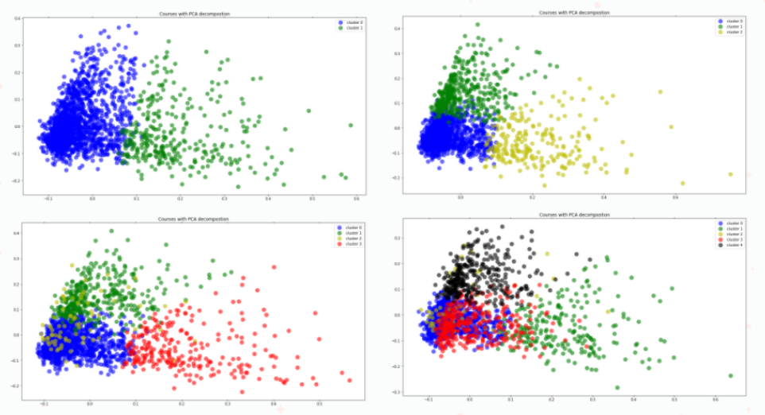
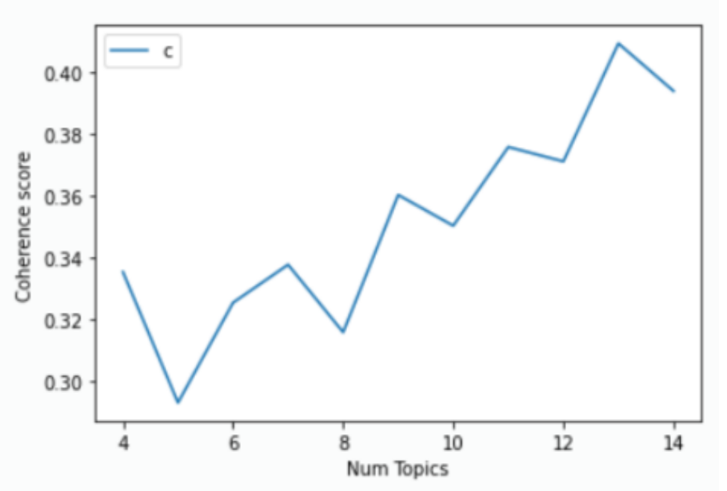
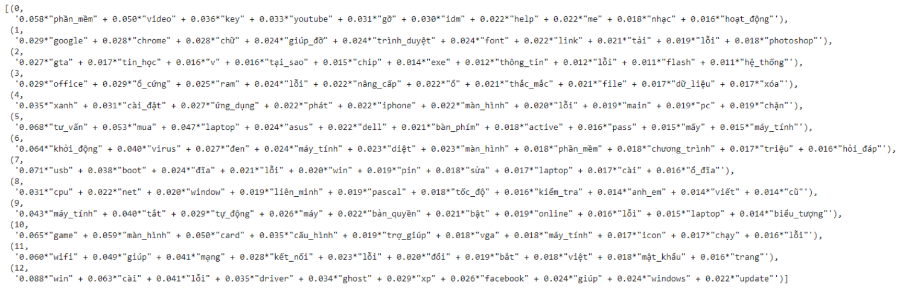
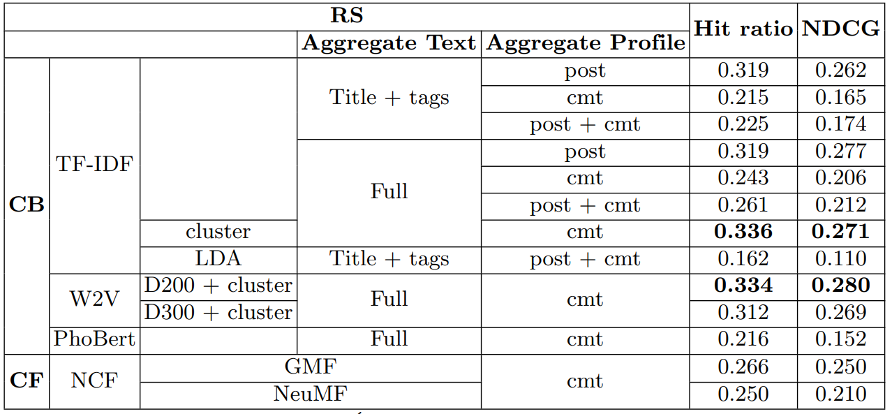

# Recommender-system-for-Vietnamese-Q&A-forum

Recommender system course | DS300

UIT | 2021
## About

* This is a college course project that aims to create a recommender system to help the Vietnamese forums.
* Techniques applied:
> * Data collection and Data Processing.
> * Word Embedding (TF-IDF, W2V), clustering, topic modeling(LDA).
> * Recommended methods: Content-based Filtering and Collaborative Filtering + Neural Network (NCF).
> * Metrics: Hit_ratio, NDCG.
> * Model Deployment with Flask.

## Data source
You can find the data here:
* <a href="Raw_data.zip" target="_blank">Raw Data</a>
* <a href="Cleaned_data.zip" target="_blank">Cleaned Data</a>

## Some Details 
* Dataset: 
> * Collection sources: Forum <a href="https://vfo.vn/" target="_blank">vfo.vn</a>.
> * Visit the report to find the codebook of my dataset.

* Task:
> * Input: User ID in system.
> * Output: Top 10 recommended posts.

* Experiment

> The techniques used as well as the processes and approaches to the problem are detailed in my report file, see it to understand better. And here are some of the results obtained after the experiment:
> * Apply clustering: 

<i>Fig. 1.The results of clustering with k are 2, 3, 4, 5, respectively and choose k=3.</i>

> * LDA: 

<i>Fig. 2.Experimental results with different numbers of topics and choose num_topics=13.</i>

<i>Fig. 3.Distribute the words in each topic of the LDA model with the number of topics = 13.</i>

> * Results based on Top 10 Hit ratio and NDCG.: 

<i>Fig. 4.Experimental results.</i>

## Code

* All codes are in this repo are implemented in Google Colab and some baseline code attached :
> * Crawling data from Forum with Beautiful Soup: <a href="Crawling_vfo.ipynb" target="_blank">Crawling_vfo.ipynb</a>.
> * Content-based Filtering: <a href="Content_based_RS.ipynb" target="_blank">Content_based_RS.ipynb</a>.
> * Content-based Filtering + LDA:<a href="LDA.ipynb" target="_blank"> Build model LDA</a>, <a href="CB_LDA.ipynb" target="_blank">CB on LDA</a>.
> * NCF: <a href="NCF.ipynb" target="_blank">NCF.ipynb</a>.

## Report

* Text report: <a href="Report.pdf" target="_blank">Report</a>.
* Slide: <a href="Slide.pdf" target="_blank">Slide</a>

## References

* All references are cited in the report file.

